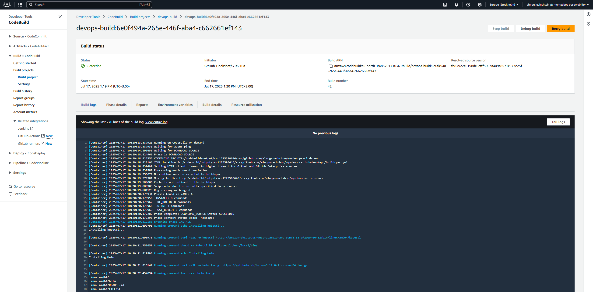
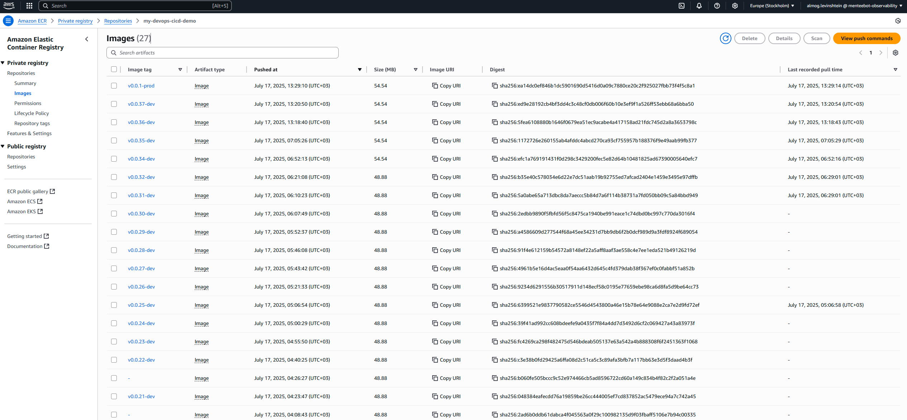
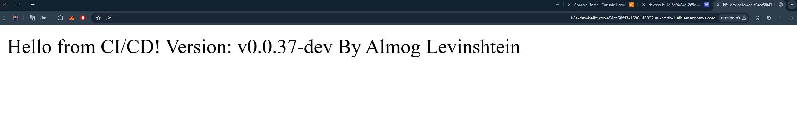

# My DevOps CI/CD Demo

This repository demonstrates a complete end-to-end CI/CD pipeline and infrastructure provisioning on AWS using Terraform, EKS, CodeBuild, Helm, and the AWS Load Balancer Controller. You’ll find everything from VPC and EKS cluster setup to a sample Flask application, automated builds, deployments, and ingress configuration.

---

## Table of Contents

1. [Project Overview](#project-overview)
2. [Architecture](#architecture)
3. [Tech Stack](#tech-stack)
4. [Folder Structure](#folder-structure)
5. [Getting Started](#getting-started)
6. [Components](#components)
   - [VPC Setup](#vpc-setup)
   - [EKS Cluster](#eks-cluster)
   - [CI/CD Pipeline](#cicd-pipeline)
   - [Application](#application)
   - [Helm Chart](#helm-chart)
   - [Load Balancer Controller](#load-balancer-controller)
7. [Usage](#usage)
8. [Screenshots](#screenshots)
9. [License](#license)

---

## Project Overview

This project showcases how to:

- Provision a **VPC** with public/private subnets using Terraform.
- Create an **EKS** cluster (private API endpoint) with managed node groups.
- Configure **IAM** roles and policies for CodeBuild and AWS Load Balancer Controller.
- Build and push a Dockerized **Flask** app to **ECR** using **AWS CodeBuild** and **GitHub Actions**.
- Deploy the app to EKS via **Helm** charts.
- Expose the service through an **AWS Application Load Balancer** managed by the AWS Load Balancer Controller.

## Architecture

1. **Terraform** provisions VPC, subnets, EKS cluster, and node groups.
2. **GitHub** triggers on push/tag events.
3. **CodeBuild** builds the Docker image, runs tests, and pushes to **ECR**.
4. **CodeBuild** (post-build) updates `kubeconfig` and deploys via **Helm**.
5. **AWS ALB Controller** watches Ingress resources and provisions an ALB.

## Tech Stack

- **Infrastructure as Code**: Terraform (terraform-aws-modules)
- **Kubernetes**: Amazon EKS (kubernetes 1.33)
- **CI/CD**: GitHub Actions, AWS CodeBuild, AWS ECR
- **Containerization**: Docker, Python 3.11 Flask app
- **Package Manager**: Helm v3
- **Ingress**: AWS Load Balancer Controller (ALB)
- **IAM**: IRSA for service accounts

## Folder Structure

```bash
D:.
+---.github                          # GitHub Actions workflows
|   +---workflows
+---app                              # Flask application + buildspec + Dockerfile
+---docs                             # Architecture diagrams & screenshots
+---helmchert                        # Helm chart for the hello-world app
|   +---.github/workflows            # Chart testing workflows
|   +---templates                    # Kubernetes manifest templates
+---policies                         # IAM policy documents (JSON)
+---terraform                        # Terraform root and modules
|   +---.terraform                   # Terraform plugin cache & modules
|   |   +---modules/eks              # vendored EKS module code
|   |   +---providers                # cached Terraform providers
|   +---eks.tf                       # EKS cluster definition
|   +---vpc.tf                       # VPC & networking definition
|   +---outputs.tf                   # Terraform outputs
|   +---variables.tf                 # Terraform variables
+---README.md                        # <-- This file
```

*(Note: The **``** and **``** directories are autogenerated by Terraform.)*

## Getting Started

### Prerequisites

- AWS CLI configured with permissions to create VPC, EKS, IAM, CodeBuild, ECR, etc.
- Terraform v1.x installed.
- kubectl installed and in PATH.
- Helm v3 installed.
- Git installed.

### Clone & Bootstrap

```bash
git clone git@github.com:almog-nachshon/my-devops-cicd-demo.git
cd my-devops-cicd-demo

# Provision infra
cd terraform
terraform init
tf apply -auto-approve

# Deploy app via GitHub Actions or manually:
# - Tag your repo: git tag v0.0.1-dev && git push origin --tags
# - CodeBuild runs and deploys automatically.
```

## Components

### VPC Setup

Uses `terraform-aws-modules/vpc/aws` to create a VPC with public/private subnets, IGW, NAT Gateway.

### EKS Cluster

- Uses `terraform-aws-modules/eks/aws`.
- Private API endpoint + restricted public CIDR.
- Managed node group `t3.medium`, autoscaling 1–4.
- IRSA enabled for Load Balancer & other services.

### CI/CD Pipeline

- **GitHub Actions** triggers on pushes & tags to `main`.
- **CodeBuild** project in VPC, uses service role with ECR/EKS/VPC policies.
- `buildspec.yml` handles:
  1. Logging in to ECR.
  2. Determining version from Git tag.
  3. Building & pushing Docker image.
  4. Updating kubeconfig & running Helm upgrade/install.

### Application

- Simple Flask app in `app/hello_world.py`.
- Dockerfile accepts `--build-arg VERSION` and exposes it.
- `requirements.txt` defines dependencies (e.g., Flask).

### Helm Chart

- Chart located in `helmchert/`.
- Template values for `service.type`, ports, ingress, HPA, etc.
- Values files per environment.

### Load Balancer Controller

- Installed via Helm in `kube-system`.
- Uses IRSA service account `aws-load-balancer-controller`.
- Custom IAM policy applied.
- Ingress manifests in Helm chart annotated for ALB.

## Usage

1. **Tag & push** a new version:
   ```bash
   git tag v0.0.2-dev && git push origin v0.0.2-dev
   ```
2. **Monitor** CodeBuild logs in AWS Console.
3. **Access** the app via the ALB DNS:

```bash
kubectl get ingress -n dev -o jsonpath='{.items[0].status.loadBalancer.ingress[0].hostname}'
```

Open `http://<ALB_DNS>/`.

## Screenshots

| Step                     | Screenshot |
| ------------------------ | ---------- |
| CodeBuild Pipeline       ||
| ECR                      ||
| ALB Ingress              ||


